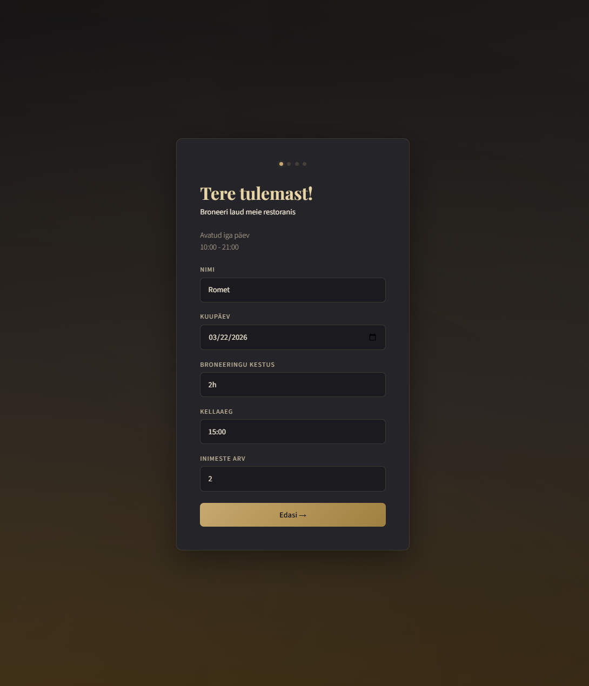
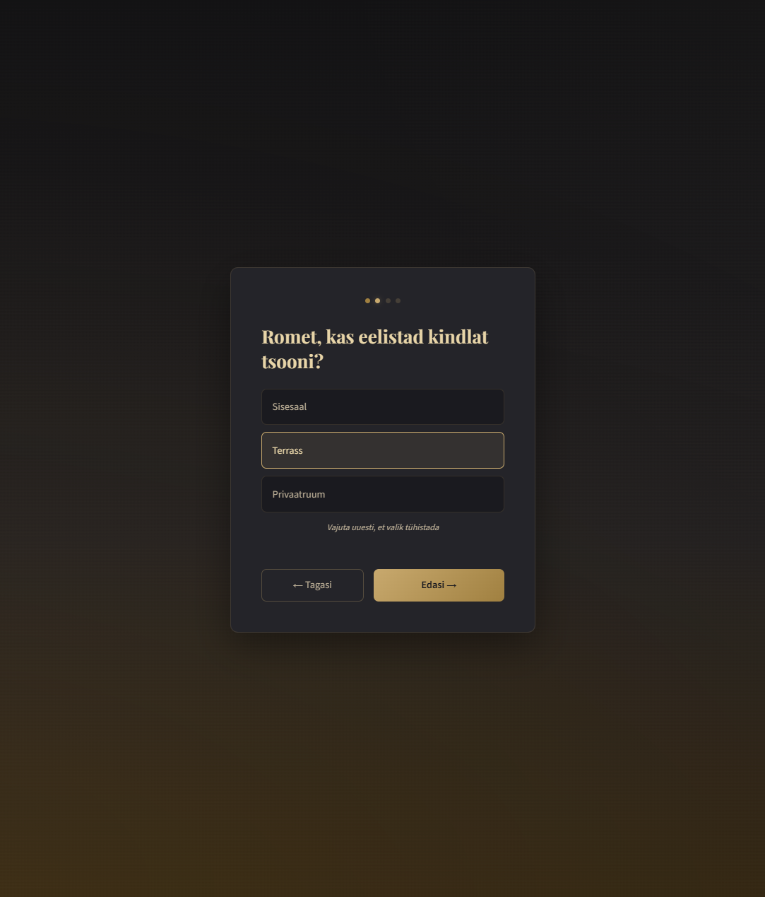
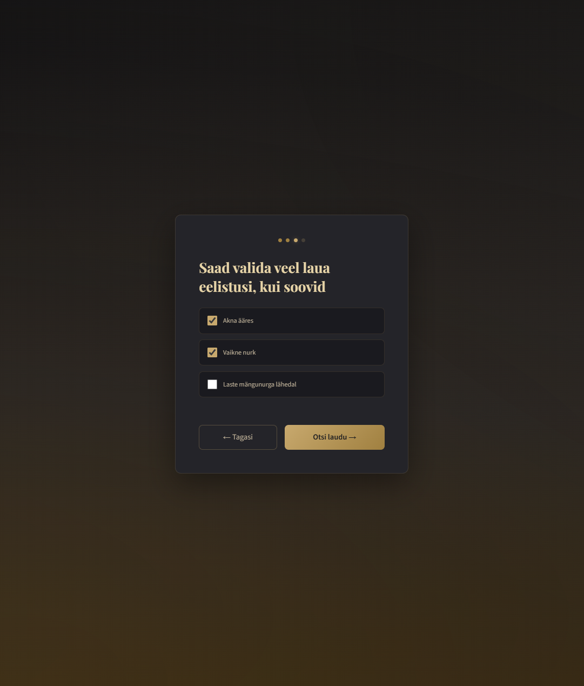
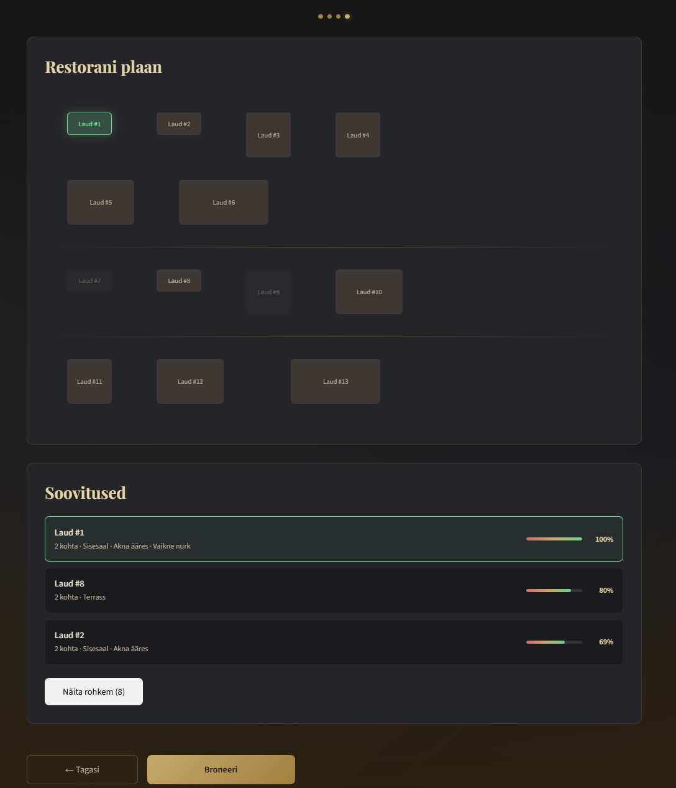
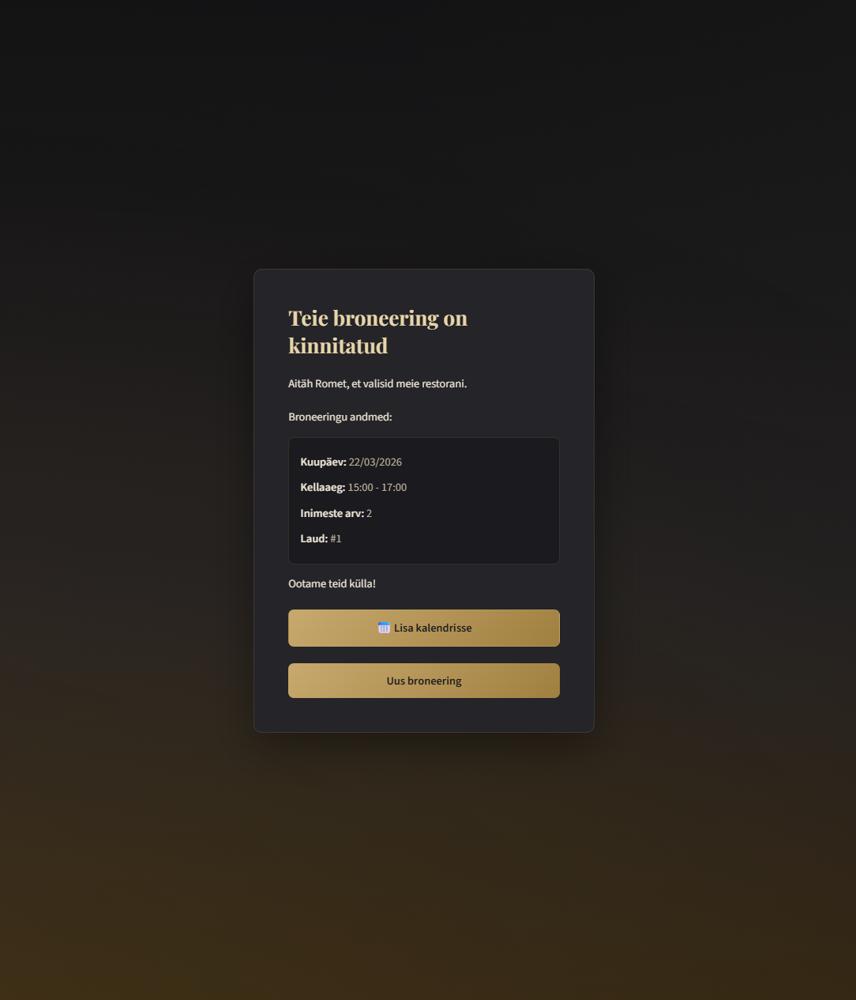

# Restorani Reserveerimissüsteem

Restorani laudade broneerimise veebirakendus, mis soovitab kliendile parimat lauda skooripõhise algoritmi abil.

## Tehnoloogiad

**Backend:** Java 25, Spring Boot 4.0.4, Spring Data JPA, H2 in-memory andmebaas, Maven

**Frontend:** React (Vite), CSS

**Muu:** Docker, JUnit 5, Mockito

## Käivitamine

### 1. Lokaalselt

**Backend:**
```bash
./mvnw spring-boot:run
```
Backend käivitub aadressil `http://localhost:8080`.

**Frontend:**
```bash
cd frontend
npm install
npm run dev
```
Frontend käivitub aadressil `http://localhost:5173`.

### 2. Docker

```bash
docker build -t restaurant-reservation .
docker run -p 8080:8080 -p 5173:5173 restaurant-reservation
```

### H2 andmebaasi konsool

Aadressil `http://localhost:8080/h2-console`:
- JDBC URL: `jdbc:h2:mem:restaurant`
- User: `sa`
- Password: <tühi>

### Testide käivitamine

```bash
./mvnw test
```

## Funktsionaalsus

### 1. Broneeringu otsing ja filtreerimine

Kasutaja läbib sammhaaval broneerimise protsessi:

- **Algandmed** - nimi, kuupäev, broneeringu kestus (1-3h), kellaaeg ja inimeste arv. Kuupäev on piiratud tänasest edasi, kellaaeg arvestab restorani lahtiolekuaegu (10:00-21:00) ja broneeringu kestust. Kõik peale nime saavad algväärtused.
- **Tsooni valik** - sisesaal, terrass või privaatruum. Saab valida ainult ühe, ei ole kohustuslik ühtegi valida.
- **Eelistused** - akna ääres, vaikne nurk, laste mängunurga lähedal. Saab valida ükskõik mitu, ei ole kohustuslik ühtegi valida.

### 2. Laua soovitamine ja paigutuse loogika

Soovitusalgoritm (`RecommendationService`) arvutab igale vabale lauale sobivuse skoori (0-100%).

- **Mahutavuse efektiivsus** - mida vähem tühje kohti, seda kõrgem skoor. 2-liikmelist seltskonda ei paigutata 8-kohalisse lauda, kui 2-kohaline on saadaval.
- **Tsooni klappivus** - suurema kaaluga kui eelistused. Soovitud tsooni laud saab +35 punkti, vale tsooni laud -20.
- **Eelistuste sobivus** - iga eelistus annab +25;-15, erandina laste mängunurga lähelolu (+30;-18).
- **Dünaamiline laudade liitmine** - kui ükski üksik laud ei mahuta seltskonda, otsib algoritm kõrvuti asuvaid laudu mida saab kokku lükata. Kõrvuti asumine arvestab laudade tegelike mõõtmetega ja tsooniga.

Algoritmi lõpus skoorid normaliseeritakse vahemikku [0-100].

Kirjutatud 22 unit testi algoritmi korrektsuses veendumiseks.

### 3. Visuaalne plaan

Restorani saaliplaan kuvatakse 2D ruudustikuna:
- Iga istekoht on üks ruut
- Laudade mõõtmed vastavad mahutavusele (2-kohaline: 2x1, 4-kohaline: 2x2, 6-kohaline: 3x2, 8-kohaline: 4x2)
- Hõivatud lauad on helehallid, selgelt eristatavad vabadest laudadest
- Soovitatud laud on roheliselt esile tõstetud
- Tsoonid on eraldatud joontega
- Soovitusele klikkides tõstetakse vastav laud plaanil esile

### 4. Lisafunktsionaalsus

- **Kalendrisse lisamine** - pärast broneerimist saab sündmuse lisada kalendrisse (.ics fail).
- **Juhuslikud broneeringud** - rakenduse käivitamisel genereeritakse 5-10 juhuslikku broneeringut mis on hajutatud tänase ja homse peale.
- **Docker** - rakendus on paigutatud Dockeri konteinerisse.

## API endpointid

| Meetod | URL | Kirjeldus |
|--------|-----|-----------|
| GET | `/api/tables` | Kõik lauad |
| GET | `/api/reservations` | Kõik broneeringud |
| POST | `/api/reservations` | Uus broneering |
| GET | `/api/recommendations?date=...&startTime=...&endTime=...&partySize=...` Valikulised: `&zone`, `&windowSeat`, `&cornerSeat`, `&kidsAreaSeat` | Soovitus filtrite alusel |


## Ajakulu

| Etapp | Aeg |
|-------|-----|
| Projekti seadistamine ja planeerimine | ~0.5h |
| Backend (entity'd, repository'd, kontrollerid) | ~2h |
| Soovitusalgoritm | ~1.5h |
| Testid | ~1h |
| Frontend (wizard, saaliplaan, soovitused) | ~3h |
| Refactoring ja Docker | ~1h |
| Dokumentatsioon | ~1.5h |
| **Kokku** | **~10.5h** |

## Keerulised kohad

- **Spring Boot** - esimene praktiline kokkupuude raamistikuga. Alguses kulus aega annotatsiooni- ja kihtide loogika mõistmisele, kuid projekti lõpuks tundsin end enesekindlalt. Väga mugav raamistik kui põhitõed selged.
- **React** - samuti esimene kokkupuude, kuid varasem Vue kogemus aitas kiiresti harjuda. Komponentide loogika ja state haldamine on üsna sarnased. Frontendile kulus oodatust rohkem aega, kuna jäin disaini muutmisega hasarti.

## AI kasutamine

Kui tekkis arusaamatu koht või küsimus, kasutasin Claude õppevahendina. Peamiselt Spring Booti puhul - küsisin miks ja kuidas asjad töötavad ning vajadusel lasin näiteid tuua, et paremini mõista. Kasutasin Claude .ics faili koodi genereerimisel, pärast palusin tal seletada seda täpsemalt ja õppisin ka selgeks. Teadsin kuidas need töötavad kuid ei olnud neid varem ise loonud. CSS stiilide kirjutamisel kasutasin AI'd rohkem, kuna tahtsin kiiresti erinevaid disainivariante katsetada. CSS on mulle varasemast tuttav, seega otsustasin aja kokkuhoiuks selle osa delegeerida ja keskenduda ise teemade peale, mis olid mulle uued.

## Demo

### 1. Algandmed


### 2. Tsooni valik


### 3. Muud eelistused


### 4. Soovitused


### 5. Broneeringu kinnitus
